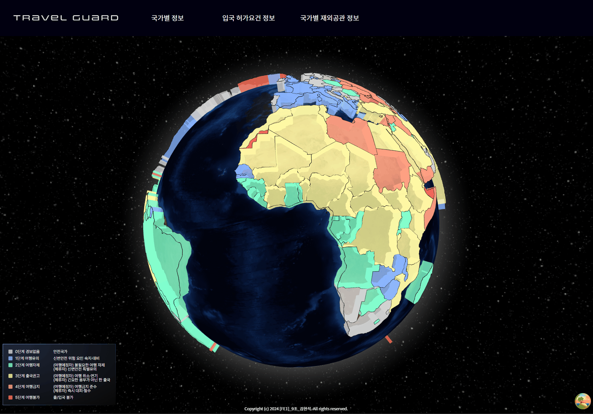

진행중

- [ ] import lazy를 이용하여 렌더링 속도 향상 시키기.
- [ ] GeoJSON과 여행경보 API fetch 데이터를 병합하여 Globe 렌더링 시 반복된 비교 연산 줄이기.
- [ ] Suspense와 React Query의 isLoading을 활용하여, 데이터 fetch 중 대체 컨텐츠 보여주기.
- [ ] 데이터 fetch 오류 시, 재 요청 구현.
- [ ] (추후) 국가별 커뮤니티 게시판, 국가별 채팅방 구현(백엔드 도)

완료

- [x] react-globe-gl을 이용한 지구 구현.
- [x] Globe에 GeoJSON 정보를 이용 국가 Polygon 적용.
- [x] Globe 국가 타일에 Fetch 받아온 위험경보 매치
- [x] Globe의 Polygon에 마우스 Hover시 해당 국가 내용 표시.
- [x] React-Query와 axios를 활용하여 API fetch 훅 작성.
- [x] 여행경보 API + 입국 허가요건 정보 API를 fetch 받은 후 새로운 데이터 타입을 반환하는 util 함수 작성(useMemo 활용하여 새로운 fetch시에만 연산).
- [x] 입국 허가요건 정보 페이지 구현.
- [x] 국가별 재외공관 정보 페이지 구현.
- [x] 국가별 상세페이지 구현.
- [x] 모달 창 구현.
- [x] Globe의 Polygon 클릭시 상세 페이지 이동 구현.
- [x] Mobile, LargeMobile, Tablet, LargeTablet, Desktop 반응형 레이아웃 구현.
- [x]글로벌 Theme을 이용한 레이아웃 정형화_(개선 예정)_

# Travel Guard (국가별 여행경보 및 정보 제공 서비스)

- 제공 서비스
  - 여행경보 단계
  - 국가별 입국 허가 정보
  - 국가별 재외공관 정보
  - 안전 공지
  - 국가별 상세 정보

---

## 배포 주소

https://travelguard-zeta.vercel.app/

## 페이지 설명

### Globe 페이지(초기 화면)

- 국가별 위험경보를 3D 지구본 상에 시각적 색상으로 표시.
- 국가에 마우스 Hover시 좀 더 상세한 위험경보 정보 확인 가능.
- 국가 클릭시 해당 국가의 상세정보 페이지로 이동 가능.

### 국가별 정보 페이지

- 여행경보가 제공되는 전체 국가 리스트 확인 가능. (default)
- 국가명 검색으로 해당 국가의 상세 페이지로 접근 가능.
- 위험경보 단계별로 탭으로 구분되어 위험경보 단계별 국가들 확인 가능.
- 국가명 클릭으로 해당 국가 상세페이지 접근 가능.

### 입국 허가요건 정보 페이지

- 여권 입국 정보가 제공되는 전체 국가 확인 가능. (default)
- 국가명 검색으로 해당 국가의 입국 정보 확인 가능.
- 상세페이지 버튼으로 해당 국가의 상세페이지 접근 가능.

### 국가별 재외공관 정보 페이지

- 전체 재외공관 리스트 확인 가능. (default)
- 국가명 또는 지역명을 통해 재외공관 검색 가능.
- 재외공관명, 주소, 대표번호, 긴급번호 제공.
- 상세페이지 버튼으로 해당 국가의 상세페이지 접근 가능.

### 국가별 상세페이지

- 모든 페이지에서 접근 가능.
- 국가별 긴급 안전공지 확인 가능.
- Globe 보다 상세한 위험경보 지도 제공. (클릭시 확대 가능)
- 재외공관 정보 확인 가능
- 입국 허가 요건 정보 확인 가능.
